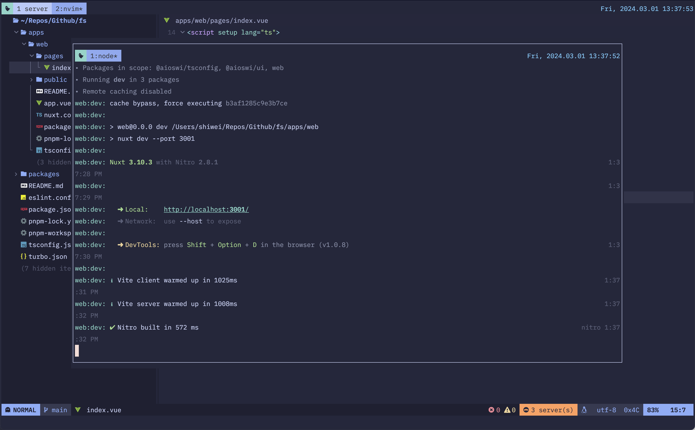
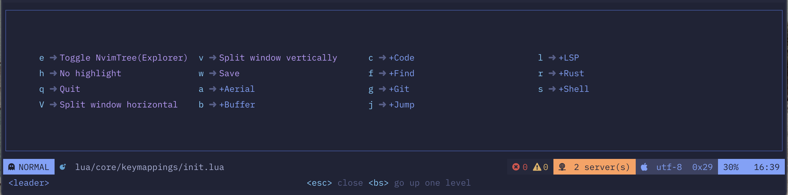
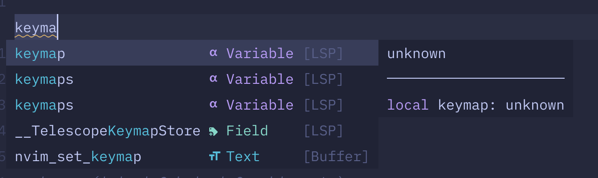
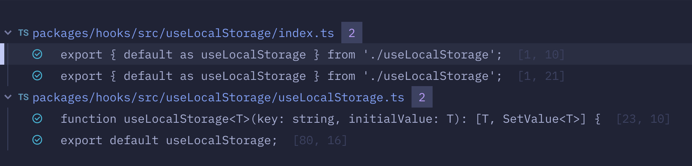
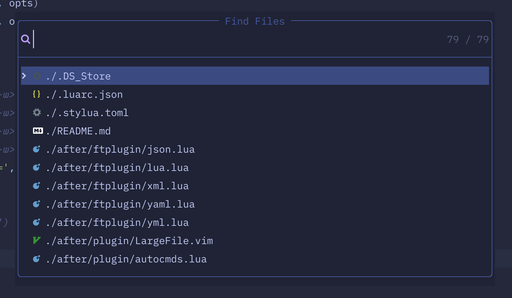

# Dotfiles Configuration

Use [dotdrop](https://github.com/deadc0de6/dotdrop) to backup my dotfiles
configuration. Include **nvim**/**zsh**/**tmux**/**kitty** etc.

## tmux

I'd like to map `<C-]>` as my prefix key.

## neovim

Neovim is awsome and there are too many fantistic plugins.

