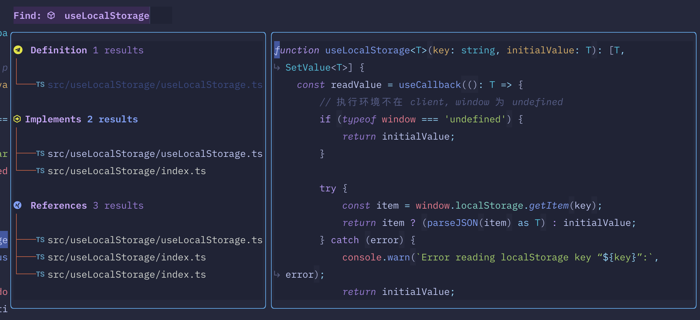

# Dotfiles Configuration

Use [dotdrop](https://github.com/deadc0de6/dotdrop) to backup my dotfiles configuration. Include **nvim**/**zsh**/**tmux**/**kitty** etc.

## tmux

I'd like to map `<C-]>` as my prefix key.

## neovim

Neovim is awsome and there are too many fantistic plugins. Like which-key, telesope, trouble etc.

**alpha dashboard**

**which-key panel**

**LSP finder powerd by lspsaga**

**CMP**

**Reference by troubld**

**fuzzy finder**

