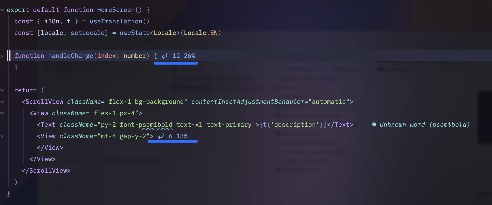

# Swi's dotfiles

  
More screenshots

  
  
  

## Contents

- Neovim config
- Tmux
- Kitty terminal

## Neovim setup

Based on [💤 lazy.nvim](https://www.lazyvim.org/)

### Requirements

- Neovim >= 0.10.0
- A [Nerd font](https://github.com/ryanoasis/nerd-fonts), I am using IBM Plex Mono
